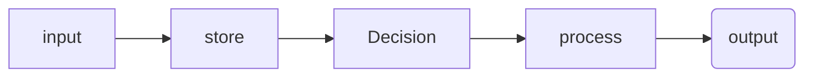

All computers: input --> store --> process --> output

## Binary 
- maxiumum states `2^n`
- highest value it can represent: `2^n - 1`

## Program ideas
- [ ] Random name list selector

## Key terms

- ==sampling== is converting an analog signal to a digital one (p150)
- ==analog== data has values that change smoothly over time and are continuous signals (p150)
- ==digital== data is a analog signal that has been broken up into steps and are discreet time signals (p150)
- ==abstraction== are when bits are grouped to find common fetures and can shrink the size of the code (p149)

## Revision
Test these
go through each unit and get unit vocab e.g. https://studio.code.org/courses/csp-2025/units/1/vocab