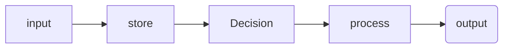
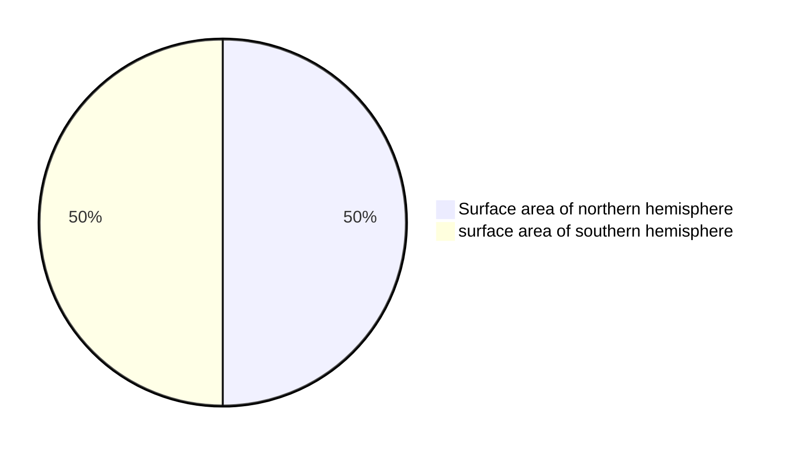

All computers: input-->store-->process-->output

# Stuff to remember
-  computing device is a physical artifact that can run a program. Some examples include computers, tablets, servers, routers, and smart sensors.
- Computers use binary because their hardware is based on two states (on/off), making it efficient to store and process all types of data, including images and text, as sequences of 0s and 1s.

- A single effect can be viewed as both beneficial and harmful by different people, or even by the same person.

- **Algorithm:** An algorithm is a finite set of instructions that accomplish a specific task. Every algorithm can be constructed using combinations of sequencing, selection, and iteration.
- **Arguments:** The values of the parameters when a procedure is called.
- **Collection type:** Aggregates elements in a single structure. Some examples include: databases, hash tables, dictionaries, sets, or any other type that aggregates elements in a single structure.
- **Data stored in a list:** Input into the list can be through an initialization or through some computation on other variables or list elements.
- **Input:** Program input is data that are sent to a computer for processing by a program. Input can come in a variety of forms, such as tactile (through touch), audible, visual, or text. An event is associated with an action and supplies input data to a program.
- **Iteration:** Iteration is a repetitive portion of an algorithm. Iteration repeats until a given condition is met or for a specified number of times. The use of recursion is a form of iteration.
- **List:** A list is an ordered sequence of elements. The use of lists allows multiple related items to be represented using a single variable. Lists are referred to by different terms, such as arrays or arraylists, depending on the programming language.
- **List being used:** Using a list means the program is creating new data from existing data or accessing multiple elements in the list.
- **Output:** Program output is any data that are sent from a program to a device. Program output can come in a variety of forms, such as tactile, audible, visual, movement, or text.
- **Parameter:** A parameter is an input variable of a procedure. Explicit parameters are defined in the procedure header. Implicit parameters are those that are assigned in anticipation of a call to the procedure. For example, an implicit parameter can be set through interaction with a graphical user interface.
- **Procedure:** A procedure is a named group of programming instructions that may have parameters and return values. Procedures are referred to by different names, such as method, function, or constructor, depending on the programming language.
- **Program code segment:** A code segment refers to a collection of program statements that are part of a program. For text-based, the collection of program statements should be continuous and within the same procedure. For block-based, the collection of program statements should be contained in the same starter block or what is referred to as a “Hat” block.
- **Program functionality:** The behavior of a program during execution, often described by how a user interacts with it.
- **Purpose:** The problem being solved or creative interest being pursued through the program.
- **Selection:** Selection determines which parts of an algorithm are executed based on a condition being true or false. The use of try/exception statements is a form of selection statements.
- **Sequencing:** The application of each step of an algorithm in the order in which the code statements are given.
- **Student-developed procedure / algorithm:** Program code that is student developed has been written (individually or collaboratively) by the student who submitted the response. Calls to existing program code or libraries can be included but are not considered student developed. Event handlers are built-in abstractions in some languages and will therefore not be considered student-developed. In some block-based programming languages, event handlers begin with “when”.

=======
## Binary 
- maxiumum states `2^n` or  ${2^n}$

- highest value it can represent: `2^n - 1` ${{2^n}-1}$

## Program ideas
- [ ] Random name list selector

 
## Key terms

Sampling ‼️  IMPROVE ‼️ 
> is converting an analog signal to a digital one (p150)

Analog data  〰️ 
> has values that change smoothly over time and are continuous signals (p150)

Digital 1️⃣ / 0️⃣ 
>  data is a analog signal that has been broken up into steps and are discreet time signals (p150)

Abstraction 📚 
>  ~are when bits are grouped to find common fetures and can shrink the size of the code (p149)~
> is a simplified representation of something complex that hides unnecessary details, allowing us to focus on high-level operations or ideas.

Binary 1️⃣0️⃣0️⃣1️⃣
> is a way of representing information using only two options.

Bit 0️⃣
> (binary digit) is a single unit of information in a computer, typically represented as a 0 or 1.

Lossless compression  🌕
> reduces file size without losing any information. The original data can be perfectly reconstructed.

Lossy compression 🌔
> reduces file size by removing some data, resulting in a loss of quality. The original data cannot be perfectly restored.

intellectual property 
> any intangible creations of the mind, such as inventions, artistic works, designs, brand names, and symbols.

creative commons 
> a license that allows you to freely use materials created by others.

ASCII (American Standard Code for Information Interchange) 
>  a character encoding standard that assigns numbers to letters, digits, and symbols so computers can represent and process text.

A pixel 
> the smallest unit of a digital image, representing a single point of color or shade.

bitmap 
> a way of representing an image as a grid of pixels, where each pixel’s value is stored in binary. For black and white images, each pixel is typically 1 bit.

RGB 
> stands for Red, Green, Blue. In digital images, each pixel’s color is created by combining different intensities of these three colors, usually with 8 bits per channel.

Computing Device
> electronic machines that perform tasks automatically by executing instructions, enabling them to process, store, and analyze data

Computing System
> a combination of physical components (hardware) and instructions (software) that work together to perform tasks, such as receiving, storing, processing, and transmitting information

Computing Network
> a collection of two or more interconnected computing devices that share data, resources, and services using physical or wireless connections and agreed-upon communication protocols

Path
> a string of characters that specifies the unique location of a file, directory, or other resource within a file system or a hierarchical structure

Bandwidth
> the maximum theoretical amount of data that can be transmitted over a communication channel within a given period of time, typically measured in bits per second (bps)

Transmission Control Protocol (TCP)
> defines how computers sends data packets to each other. guides how data is subdivided into packets before transmission. 

User Datagram Protocol (UDP)
> allows computers to send messages without checking for missing packets to save time. this makes UPD less reliable but faster than TCP.

Sequential Computing
> problem is broken into discrete instructions then executed one by one by a single device having a single CPU

Parallel Computing
> problem is broken into discrete instructions then executed concurrently by using multiple CPUs. it is used for real world simulations and modeling.

Distributed Computing
> multiple devices used to run a program. Used to solve problems faster and allows problems to be solved that would be impossible for a single computer.

Router
> a network device that connects two or more separate networks, such as a home network to the Internet, by forwarding data packets to their correct destinations.

Switch
> a switch is a networking device that connects multiple devices on a single local area network (LAN) and directs data traffic to the correct destination using a Media Access Control (MAC) address.

Packet
> a small, standardized unit of data used to transmit information across a network, like the internet.

Firewall
> a security system that acts as a barrier between a trusted network and an untrusted network.

Internet Protocol (IP)
> the fundamental network protocol that governs how data is routed and addressed across the internet and other networks.

Domain Name System (DNS)
> acts as the internet's "phonebook," translating human-friendly domain names into machine-readable IP addresses.

HyperText Transfer Protocl (HTTP)
> the underlying set of rules, or protocol, for data transfer over the internet, enabling web browsers (clients) to request and retrieve resources like web pages, images, and videos from web servers.

Expression
> a combination of operators and values that evaluates to a single value.

Variable
> holds one value at a time.
> a reference to a value (or value that results from evaluation an expression) that can be used repeatedly throughout a program.

Assignment Operator
> allows a program to change the value represented by a variable.

Correlation
> statistical measure showing how two or more variables change together, indicating the strength and direction of their relationship.

Metadata
> data about data, providing context, description, and management info for other data, making it easier to find, use, and organize.

Filter
> create a subset of elements from the original list

Reduce
> reduce the list down to a single element, for example: the smallest number in the list

Map
> add or change each item in a list.

Argument
> The values of the parameters when a procedure is called.

Parameter
> A parameter is an input variable of a procedure. Explicit parameters are defined in the procedure header. Implicit parameters are those that are assigned in anticipation of a call to the procedure. For example, an implicit parameter can be set through interaction with a graphical user interface.

Return
> returns an object to where it was called from.

Procedural Abstraction
> provides a name for a process and allows the rocedure to be used only knowing what it does, and not necessarily how it does it.

Modularity
> the subdivision of a computer program into seperate subprograms.

Library
> a function collection of functions that can be used in many different programs.

API
> (Application Program Interface) are specifications for how the functions in a library behave and can be used.

Rogue Access Point
> Any unauthorized wireless access point or router connected to a secure network without administrative approval.

Malware
> Any software code, program, or script intentionally designed to disrupt, damage, gain unauthorized access to, or steal information from computer systems and networks.

Phishing
> A social engineering cyberattack where attackers masquerade as trusted entities via emails, messages, or websites to trick users into revealing sensitive information.

Keylogging
> A keylogger (keystroke logger) is a hardware or software tool that secretly records every keystroke made on a computer or mobile device without the user's consent.

## Revision
- Test these
- go through each unit and get unit vocab e.g. https://studio.code.org/courses/csp-2025/units/1/vocab
- review program before exam, input, output etc
- written resposne prompts samples before submitting

## Program task - 30%
+ Submit to AP digital portfolio

## Submision
+ program code - can be collaborative ok with another student
    + Must take input from (a user e.g. an event trigger, a device, an online data stream, a file)
    + Must use at least one list or other collection type, to represent stored data and used to manage program complexity and fulfil programs purpose
    + At least one procecure the contrinutes to the programs purpose where you have defined:
        + The procedure name
        + the return type (if applicable)
        + one or more parameters
    + An algorithm that includes sequencing, selection and iterationt that is in the body of the selected procedure
    + A Call to this procecure 
    + Instructons of output (tactile, audible, visual or textual) based on input and progtams functionality
+ Video requirements: MP4, AVI, MOV, WEBM, WMV
    + must demosntrate program running including:
        + input to program
        + at least one aspect of the functionality of the program
        + Output produced
    + must not:
        + contain uer distinguishing info
        + Voice narration (text captions are OK)
        + Longer than 1 minute
        + Greater than 30MB
+ Personalised project reference - code for procedure and list - no comments here, provided to student for exam
    + Capture and paste two program code segments that contain the prodecure that imlenents the algorthm used in the ptogram
    + The first segment must be a student developed procedure that:
        + defines the procedure name and return type (if applicable)
        + Contains ans uses one or more parameters that have an effect on the functionality of the procedure
        + Implements an algorithm that includes sequencing, selecion and iteration
    + The second code segment must show where your student developed procedure is being called in the program
    + List: capture and paste two program code segments you developed as part of this task that contain a list (or other collection type) being used to manage complexity in your program
        + The first segment: show how data have been stored in the list
        + THe second: must show data in same list being used e.g. creating new data form the existing data or accessing multiopel elements in the last as part of fulfilling program purpose
 

## Exam - 70%
+ 2 hours of 70 multiple choice questions
+ 1 hour for 4 written response questions on the program task:
    + program design, function and purpose - 
    + Algorithm development
    + Errors and testing
    + Data and procedural abstraction

The performance task written resposne uses the following key verbs:
1. Capture:  select a portion of the program code that addresses the prompt(s)
2. Demonstrate: Provide evidence for an asnwer of point being made
3. Describe: provide the relevant features or characteristics of what the program code respresents of is being used to accomplish
4. Design: Develpp a plan for how to accomplish the prigram specification or requirements
5. Explain: provide the how or why something occurs, listing detail step of an algorithm of evidence and/or reasoning
6. Identify: Provide a name for the specific topic without elaboration or explanation
7. Implement/write: recognise and use the proper syntax to execure the program design

## Big Ideas Exam Weighting
+ Big Idea 1: Creative Development 10–13%
+ Big Idea 2: Data 17–22%
+ Big Idea 3: Algorithms and Programming 30–35%
+ Big Idea 4: Computer Systems and Networks 11–15%
+ Big Idea 5: Impact of Computing 21–26%

## Important info
- ap class room task: 
    - https://apstudents.collegeboard.org/ap/pdf/ap-digital-portfolio-terms-and-conditions.pdf
    - https://apcentral.collegeboard.org/courses/ap-computer-science-principles/course/faq/plagiarism-policy

## Example markdown
> [!NOTE]
> Useful information that users should know, even when skimming content.

> [!TIP]
> Helpful advice for doing things better or more easily.

> [!IMPORTANT]
> Key information users need to know to achieve their goal.

> [!WARNING]
> Urgent info that needs immediate user attention to avoid problems.

> [!CAUTION]
> Advises about risks or negative outcomes of certain actions.

