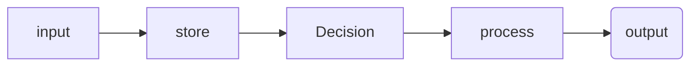
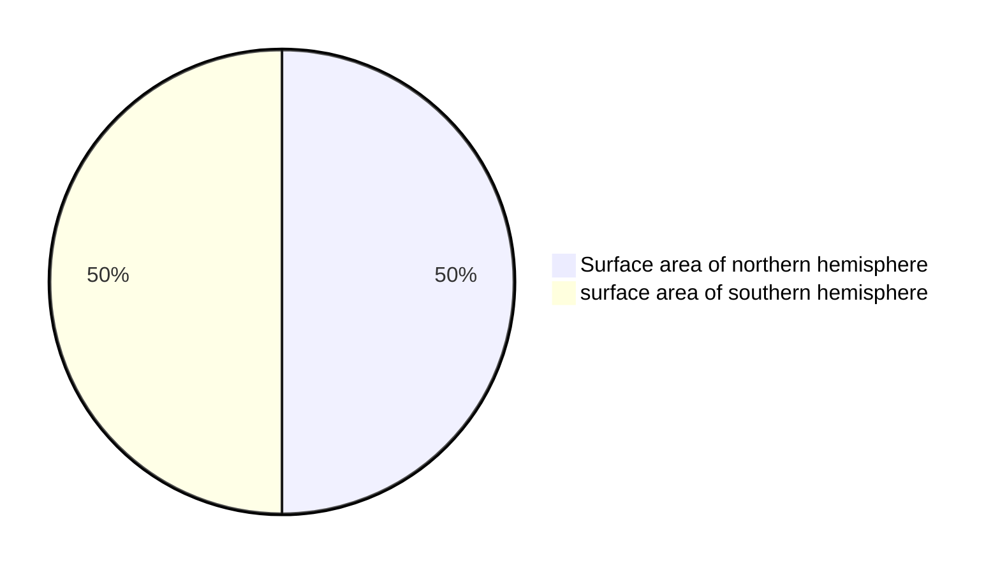

All computers: input --> store --> process --> output

## Binary 
- maxiumum states `2^n` ${n^2}$

- highest value it can represent: `2^n - 1` ${{n^2}-1}$

## Program ideas
- [ ] Random name list selector

 
## Key terms

Sampling ‼️  IMPROVE ‼️ 
> is converting an analog signal to a digital one (p150)

Analog data  〰️ 
> has values that change smoothly over time and are continuous signals (p150)

Digital 1️⃣ / 0️⃣ 
>  data is a analog signal that has been broken up into steps and are discreet time signals (p150)

Abstraction 📚 
>  ~are when bits are grouped to find common fetures and can shrink the size of the code (p149)~
> is a simplified representation of something complex that hides unnecessary details, allowing us to focus on high-level operations or ideas.

Binary 1️⃣0️⃣0️⃣1️⃣
> is a way of representing information using only two options.

Bit 0️⃣
> (binary digit) is a single unit of information in a computer, typically represented as a 0 or 1.

Lossless compression  🌕
> reduces file size without losing any information. The original data can be perfectly reconstructed.

Lossy compression 🌔
> reduces file size by removing some data, resulting in a loss of quality. The original data cannot be perfectly restored.

## Revision
- Test these
- go through each unit and get unit vocab e.g. https://studio.code.org/courses/csp-2025/units/1/vocab

## Example markdown
> [!NOTE]
> Useful information that users should know, even when skimming content.

> [!TIP]
> Helpful advice for doing things better or more easily.

> [!IMPORTANT]
> Key information users need to know to achieve their goal.

> [!WARNING]
> Urgent info that needs immediate user attention to avoid problems.

> [!CAUTION]
> Advises about risks or negative outcomes of certain actions.

