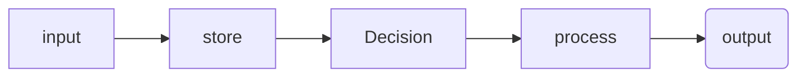

All computers: input --> store --> process --> output

## Binary 
- maxiumum states `2^n`
- highest value it can represent: `2^n - 1`

## Program ideas
- [ ] Random name list selector

 
## Key terms

Sampling
> is converting an analog signal to a digital one (p150)

Analog data 
> has values that change smoothly over time and are continuous signals (p150)

Digital
>  data is a analog signal that has been broken up into steps and are discreet time signals (p150)

Abstraction
>  ~are when bits are grouped to find common fetures and can shrink the size of the code (p149)~
> is a simplified representation of something complex that hides unnecessary details, allowing us to focus on high-level operations or ideas.

Binary
> is a way of representing information using only two options.

Bit
> (binary digit) is a single unit of information in a computer, typically represented as a 0 or 1.

Lossless compression
> reduces file size without losing any information. The original data can be perfectly reconstructed.

Lossy compression
> reduces file size by removing some data, resulting in a loss of quality. The original data cannot be perfectly restored.

## Revision
- Test these
- go through each unit and get unit vocab e.g. https://studio.code.org/courses/csp-2025/units/1/vocab

