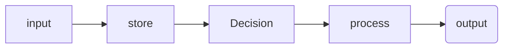
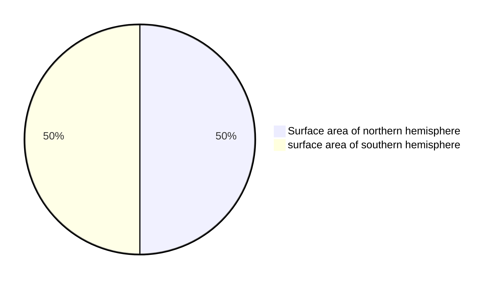

All computers: input-->store-->process-->output

# Stuff to remember
-  computing device is a physical artifact that can run a program. Some examples include computers, tablets, servers, routers, and smart sensors.
- Computers use binary because their hardware is based on two states (on/off), making it efficient to store and process all types of data, including images and text, as sequences of 0s and 1s.

- A single effect can be viewed as both beneficial and harmful by different people, or even by the same person.

=======
## Binary 
- maxiumum states `2^n` or  ${2^n}$

- highest value it can represent: `2^n - 1` ${{2^n}-1}$

## Program ideas
- [ ] Random name list selector

 
## Key terms

Sampling ‼️  IMPROVE ‼️ 
> is converting an analog signal to a digital one (p150)

Analog data  〰️ 
> has values that change smoothly over time and are continuous signals (p150)

Digital 1️⃣ / 0️⃣ 
>  data is a analog signal that has been broken up into steps and are discreet time signals (p150)

Abstraction 📚 
>  ~are when bits are grouped to find common fetures and can shrink the size of the code (p149)~
> is a simplified representation of something complex that hides unnecessary details, allowing us to focus on high-level operations or ideas.

Binary 1️⃣0️⃣0️⃣1️⃣
> is a way of representing information using only two options.

Bit 0️⃣
> (binary digit) is a single unit of information in a computer, typically represented as a 0 or 1.

Lossless compression  🌕
> reduces file size without losing any information. The original data can be perfectly reconstructed.

Lossy compression 🌔
> reduces file size by removing some data, resulting in a loss of quality. The original data cannot be perfectly restored.

intellectual property 
> any intangible creations of the mind, such as inventions, artistic works, designs, brand names, and symbols.

creative commons 
> a license that allows you to freely use materials created by others.

ASCII (American Standard Code for Information Interchange) 
>  a character encoding standard that assigns numbers to letters, digits, and symbols so computers can represent and process text.

A pixel 
> the smallest unit of a digital image, representing a single point of color or shade.

bitmap 
> a way of representing an image as a grid of pixels, where each pixel’s value is stored in binary. For black and white images, each pixel is typically 1 bit.

RGB 
> stands for Red, Green, Blue. In digital images, each pixel’s color is created by combining different intensities of these three colors, usually with 8 bits per channel.

Computing Device
> electronic machines that perform tasks automatically by executing instructions, enabling them to process, store, and analyze data

Computing System
> a combination of physical components (hardware) and instructions (software) that work together to perform tasks, such as receiving, storing, processing, and transmitting information

Computing Network
> a collection of two or more interconnected computing devices that share data, resources, and services using physical or wireless connections and agreed-upon communication protocols

Path
> a string of characters that specifies the unique location of a file, directory, or other resource within a file system or a hierarchical structure

Bandwidth
> the maximum theoretical amount of data that can be transmitted over a communication channel within a given period of time, typically measured in bits per second (bps)

## Revision
- Test these
- go through each unit and get unit vocab e.g. https://studio.code.org/courses/csp-2025/units/1/vocab

## Program task - 30%
+ Submit to AP digital portfolio

## Submision
+ program code - can be collaborative ok with another student
    + Must take input from (a user e.g. an event trigger, a device, an online data stream, a file)
    + Must use at least one list or other collection type, to represent stored data and used to manage program complexity and fulfil programs purpose
    + At least one procecure the contrinutes to the programs purpose where you have defined:
        + The procedure name
        + the return type (if applicable)
        + one or more parameters
    + An algorithm that includes sequencing, selection and iterationt that is in the body of the selected procedure
    + A Call to this procecure 
    + Instructons of output (tactile, audible, visual or textual) based on input and progtams functionality
+ Video requirements: MP4, AVI, MOV, WEBM, WMV
    + must demosntrate program running including:
        + input to program
        + at least one aspect of the functionality of the program
        + Output produced
    + must not:
        + contain uer distinguishing info
        + Voice narration (text captions are OK)
        + Longer than 1 minute
        + Greater than 30MB
+ Personalised project reference - code for procedure and list - no comments here, provided to student for exam
    + Capture and paste two program code segments that contain the prodecure that imlenents the algorthm used in the ptogram
    + The first segment must be a student developed procedure that:
        + defines the procedure name and return type (if applicable)
        + Contains ans uses one or more parameters that have an effect on the functionality of the procedure
        + Implements an algorithm that includes sequencing, selecion and iteration
    + The second code segment must show where your student developed procedure is being called in the program
    + List: capture and paste two program code segments you developed as part of this task that contain a list (or other collection type) being used to manage complexity in your program
        + The first segment: show how data have been stored in the list
        + THe second: must show data in same list being used e.g. creating new data form the existing data or accessing multiopel elements in the last as part of fulfilling program purpose
 

## Exam - 70%
+ 2 hours of 70 multiple choice questions
+ 1 hour for 4 written response questions on the program task:
    + program deisng, function and purpose
    + Algorithm development
    + Errors and testing
    + Data and procedural abstraction

## Example markdown
> [!NOTE]
> Useful information that users should know, even when skimming content.

> [!TIP]
> Helpful advice for doing things better or more easily.

> [!IMPORTANT]
> Key information users need to know to achieve their goal.

> [!WARNING]
> Urgent info that needs immediate user attention to avoid problems.

> [!CAUTION]
> Advises about risks or negative outcomes of certain actions.

